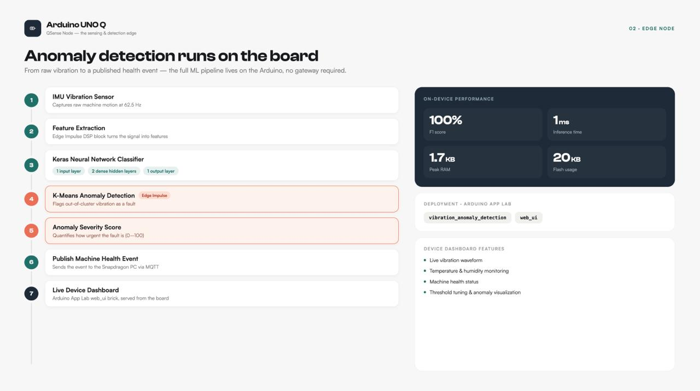
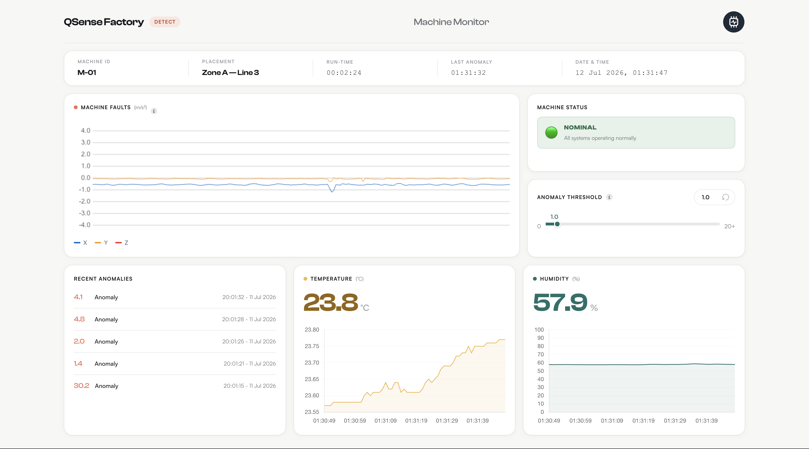

# QSense Node — Machine Monitor



> Part of **QSense Factory** · Snapdragon Multiverse Hackathon  
> Stage: **Detect** — the first node in the `Detect → Alert → Diagnose → Resolve` closed loop.



#### Hardware Node 


---

## What is QSense Factory?

QSense Factory is a **privacy-first, distributed edge-AI system** built for MSME manufacturers who can't afford to replace legacy machinery or send proprietary data to the cloud.

The system spans three devices that form a **closed loop** — not a one-way handoff:

| Device | Role | Stage |
|---|---|---|
| **Arduino UNO Q** (this repo) | Magnetically attaches to motors; continuously monitors vibration offline | Detect |
| **Snapdragon Copilot+ PC** | Receives anomaly alerts, logs events, pushes to mobile; also runs NPU-accelerated PPE detection | Alert |
| **Technician Mobile Device** | Receives alerts; locally runs a vision-language model for repair guidance from a photo | Diagnose → Resolve |

When the technician resolves the issue, the mobile device **signals back** through the PC to clear the dashboard and **reset the Arduino's baseline** — completing the cycle.

The result: a full factory AI assistant that catches problems early, explains how to fix them, and runs **entirely on-premises** — no internet required at any stage.

---

## This Repo — QSense Node

This repository contains the **Arduino UNO Q node** — the Detect stage. It retrofits existing motors with a magnetically-attached sensor that continuously monitors vibration for early signs of failure, entirely offline.

### What it does

- Reads raw accelerometer data (X, Y, Z axes) from a **Modulino Movement** sensor at 62.5 Hz
- Reads **temperature and humidity** from a **Modulino Thermo** sensor at 1 Hz
- Runs a **vibration anomaly detection** model locally on the board
- Streams live vibration and environment data to a real-time web dashboard
- Fires an alert (with anomaly score + timestamp) when vibration deviates from the learned baseline
- Publishes a structured **MQTT alert** (`machine/anomaly` topic) on every anomaly event
- Triggers a **3-second buzzer alarm** via Modulino Buzzer when the anomaly score exceeds the critical threshold (≥ 5.0)
- Accepts dynamic **threshold adjustments** from the dashboard without restarting
- Exposes a **reset endpoint** so the Copilot+ PC can reset the baseline once a repair is confirmed

### Minimum Workflow

```
  ┌──────────────┐  vibration   ┌────────────────────┐  score + alert  ┌──────────────┐
  │   Modulino   │─────────────►│    Arduino UNO Q   │────────────────►│  Dashboard   │
  │   Movement   │              │                    │                 │  (browser)   │
  └──────────────┘              │  Edge Impulse AI   │  MQTT publish   ├──────────────┤
  ┌──────────────┐  temp / hum  │  model on-device   │────────────────►│ MQTT Broker  │
  │   Modulino   │─────────────►│                    │                 │              │
  │   Thermo     │              └────────────────────┘  resolved=1    ├──────────────┤
  └──────────────┘                       ▲              ◄─────────────│  Technician  │
                                         │                             └──────────────┘
                                  Buzzer / LED /
                                  Machine stop
```

### Detailed App Flow

```
┌──────────────────────────────────────────────────────────────────────────────────┐
│                              Arduino UNO Q                                       │
│                                                                                  │
│  ┌─ Modulino Movement ─┐  62.5 Hz                                                │
│  │  X / Y / Z accel    │──Bridge.notify──► record_sensor_movement()              │
│  └─────────────────────┘                   │  g → m/s²  │  WebUI: live plot      │
│                                            │            ▼                        │
│  ┌─ Modulino Thermo ───┐   1 Hz            │   VibrationAnomalyDetection brick   │
│  │  Temperature        │──Bridge.notify──► record_sensor_samples()               │
│  │  Humidity           │                   │  WebUI: temp/humidity               │
│  └─────────────────────┘                   │  SQLite: environment table          │
│                                            ▼                                    │
│                                  on_detected_anomaly()                           │
│                                   │  SQLite: anomalies table                    │
│                                   │  MQTT → qsense/machine/monitoring            │
│                    ───────────────┴───────────────────                          │
│                    │ score < 5.0              │ score ≥ 5.0                      │
│                    ▼                          ▼                                  │
│              ⚠️ ANOMALY                  🔴 CRITICAL                             │
│              WebUI badge                 WebUI badge (LOCKED)                   │
│              MQTT →                      MQTT → qsense/machine/ack              │
│              qsense/machine/anomaly      Bridge.call → Modulino Buzzer           │
│                                          Bridge.call → LED Matrix (blink)        │
│                                          Bridge.call → Machine OFF (D9/D10)      │
│                    ───────────────────────────────────────────                  │
│                                                                                  │
│  Every 30 s ──► health heartbeat ──► MQTT → qsense/machine/health               │
│                  {status, uptime_s, timestamp}                                   │
│                                                                                  │
│  On page load ──► SQLite history ──► WebUI: anomalies + env + run-time          │
└──────────────────────────────────────────────────────────────────────────────────┘
                        │
          ┌─────────────┼───────────────────┐
          ▼             ▼                   ▼
  qsense/machine/  qsense/machine/   qsense/machine/
    monitoring       anomaly            health
  (full alert)    (non-critical)     (heartbeat)
          │
          ▼ (on resolved=1)
  qsense/machine/ack ──► LED off · Machine ON · Dashboard → 🟢 NOMINAL
```

---

## AI Model — Vibration Anomaly Detection

> Public Edge Impulse project: [QSense — Machine Monitoring EI](https://studio.edgeimpulse.com/public/1056545/live)

### Data Collection

Vibration data was captured using the **Modulino Movement** (LSM6DSOX IMU) mounted on the target machine, streaming **accX, accY, accZ at 100 Hz**. Two labels were collected:

| Label | Description |
|---|---|
| `nominal` | Machine running under normal operating conditions |
| `off` | Machine powered off / idle |

Total dataset: **182 samples · 9m 6s** of labelled vibration data.

### Impulse Design

```
Raw accX/Y/Z (100 Hz)
        │
        ▼
┌─────────────────────┐
│  Spectral Analysis  │  DSP block — extracts frequency-domain features
│  (DSP block)        │  from the time-series accelerometer data
└─────────────────────┘
        │
        ├──────────────────────────────────────┐
        ▼                                      ▼
┌──────────────────┐                 ┌───────────────────┐
│  NN Classifier   │                 │  Anomaly Detection│
│  (Keras)         │                 │  (K-means)        │
│                  │                 │                   │
│  Input layer     │                 │  Learns the       │
│  Dense layer     │                 │  cluster centroid │
│  Dense layer     │                 │  of nominal data  │
│  Output layer    │                 │                   │
│  (softmax)       │                 │  Score = distance │
└──────────────────┘                 │  from centroid    │
        │                            └───────────────────┘
        ▼                                      │
  nominal / off                                ▼
  classification                       anomaly score
                                       (used as threshold)
```

### Model Performance

| Metric | Value |
|---|---|
| **F1 Score (validation)** | **100%** |
| **F1 Score (test set)** | 76.2% |
| **Inferencing time** | **1 ms** |
| **Peak RAM usage** | **1.7 KB** |
| **Flash usage** | **20.0 KB** |
| **Target board** | Arduino UNO Q (Qualcomm QRB2210) |

The model runs entirely **on-device** with sub-millisecond inference and a minimal memory footprint — leaving ample resources for the Bridge, WebUI, and sensor loops running simultaneously.

### Deployment

The trained model was exported from Edge Impulse and deployed to the Arduino UNO Q via **Arduino App Lab** as the `vibration_anomaly_detection` brick. The app uses two Arduino App bricks:

| Brick | Purpose |
|---|---|
| `vibration_anomaly_detection` | Runs the Edge Impulse model; emits `on_anomaly` callbacks with score |
| `web_ui` | Serves the real-time dashboard; handles WebSocket messages between Python and browser |

The device-specific dashboard (`assets/index.html`) displays machine identity (ID, placement, run-time), live X/Y/Z waveforms, environment readings, alarm status, and the anomaly history — all running locally on the board with no cloud dependency.

---

### MQTT Alert Payload

Every anomaly (regardless of severity) publishes to `machine/anomaly`:

```json
{
  "alertId":   "a3f1c842-...",
  "machineNo": "M-01",
  "partName":  "Fan Motor",
  "partNo":    "PN-001",
  "severity":  1.2345,
  "timestamp": "2026-07-12T01:20:30.123456"
}
```

Configure broker, topic, and machine details at the top of `python/main.py`:

```python
MQTT_BROKER = "MQTT Broker ID" #Here our Qsense AI PC Web ID
MQTT_PORT   = 1883
MQTT_TOPIC  = "machine/anomaly"
MACHINE_NO  = "M-01"
PART_NAME   = "Fan Motor"
PART_NO     = "PN-001"
```

### Machine Control (Emergency Stop)

On a critical anomaly the machine is **automatically stopped** via two GPIO pins wired to the machine's motor driver. It restarts only when the alert is acknowledged.

| Pin | Role |
|---|---|
| `D9` (`MACHINE_PIN_A`) | Direction / enable A |
| `D10` (`MACHINE_PIN_B`) | Direction / enable B |

```cpp
// Machine running (normal operation)
digitalWrite(9, HIGH);
digitalWrite(10, LOW);

// Machine stopped (critical anomaly)
digitalWrite(9, LOW);
digitalWrite(10, LOW);
```

Configure the pins at the top of `sketch/sketch.ino`:

```cpp
#define MACHINE_PIN_A 9
#define MACHINE_PIN_B 10
```

### Alarm Severity Levels

| Score | Status | Dashboard | Buzzer | LED Matrix | Machine | Recent Anomalies |
|---|---|---|---|---|---|---|
| — | ⏳ INITIALIZING | Grey | Silent | Off | Running | — |
| Any | 🟢 NOMINAL | Sage green | Silent | Off | Running | — |
| < 5.0 | ⚠️ ANOMALY DETECTED | Amber | Silent | Off | Running | `Anomaly` — normal style |
| ≥ 5.0 | 🔴 CRITICAL | Coral red | 3-sec 1 kHz tone | Blinking | **Stopped** | `🔴 CRITICAL` — bold red, red border |
| `resolved=1` received | 🟢 NOMINAL | Sage green | Silent | Off | **Restarted** | — |

---

## Hardware Requirements

### Components List

| # | Component | Model / Spec | Role | Qty |
|---|---|---|---|---|
| 1 | **Arduino UNO Q** | Qualcomm QRB2210 | Main compute board — runs firmware, Python backend, and WebUI | 1 |
| 2 | **Modulino Movement** | LSM6DSOX IMU | Captures X/Y/Z vibration at 62.5 Hz via Qwiic | 1 |
| 3 | **Modulino Thermo** | HS300x | Reads ambient temperature + humidity at 1 Hz via Qwiic | 1 |
| 4 | **Modulino Buzzer** | — | Plays 3-second 1 kHz alarm tone on critical anomaly via Qwiic | 1 |
| 5 | **Motor Driver** | L298N (or equivalent) | Controls the demo motor (simulates machine on/off) | 1 |
| 6 | **DC Motor** | 5–12 V DC | Simulates the monitored machine; stopped on critical anomaly | 1 |
| 7 | **Qwiic Cables** | SparkFun / Arduino Qwiic | Daisy-chain Modulino sensors to the board | 3 |
| 8 | **Jumper Wires** | Male–Male | Connect motor driver to UNO Q GPIO and motor terminals | 6+ |
| 9 | **USB-C to USB-A Cable** | — | Power + serial flash | 1 |
| 10 | **External Power Supply** | 5–12 V, ≥ 1 A | Powers motor driver and motor (separate from board power) | 1 |

---

### Wiring Diagram


#### Modulino Sensors → Arduino UNO Q (Qwiic / I2C)

All three Modulino modules connect via the **Qwiic daisy-chain** on the `Wire1` I2C bus. No individual pin wiring is needed — just plug cables in sequence:

```
Arduino UNO Q
  [Qwiic port] ──── Modulino Buzzer
                         │
                    [Qwiic out] ──── Modulino Movement (LSM6DSOX)
                                          │
                                     [Qwiic out] ──── Modulino Thermo (HS300x)
```

> The Qwiic connector carries VCC (3.3 V), GND, SDA, and SCL. No soldering required.

---

#### Motor Driver (L298N) → Arduino UNO Q (GPIO)

The motor driver acts as the machine emergency stop. The UNO Q controls it via two digital GPIO pins.

```
Arduino UNO Q                L298N Motor Driver          DC Motor
─────────────                ──────────────────          ────────
  D9  (MACHINE_PIN_A) ──────► IN1                        
  D10 (MACHINE_PIN_B) ──────► IN2                        
  GND ─────────────── ──────► GND                        
                               OUT1 ──────────────────── Motor +
                               OUT2 ──────────────────── Motor −
                               12V  ◄── External PSU +
                               GND  ◄── External PSU −
                               ENA  ──── 5V (always enabled)
```

| UNO Q Pin | L298N Pin | State: Machine ON | State: Machine OFF |
|---|---|---|---|
| `D9` | `IN1` | HIGH | LOW |
| `D10` | `IN2` | LOW | LOW |
| `GND` | `GND` | — | — |

> **Important:** Power the L298N from an external supply (5–12 V), not from the UNO Q's 5 V pin. Connect GND of the external supply to GND on the UNO Q to share a common ground.

---

### Tools & Software Required

| Tool | Purpose |
|---|---|
| **Arduino App Lab** | Deploy and manage apps on the UNO Q |
| **Arduino App CLI** (`arduino-app-cli`) | Start, stop, restart, and view logs from the terminal |
| **Edge Impulse Studio** | Trained the vibration anomaly detection model (public project linked above) |
| **MQTT client** (`mosquitto_pub` / `mosquitto_sub` / MQTTX) | Test alert and ack messages on the broker |
| **Web browser** | Open the live dashboard at `http://<board-ip>:7000` |

---

## Software Requirements

- **Arduino App Lab** — to deploy and run the app on the UNO Q
- No cloud account or internet connection needed at runtime

---

## Project Structure

```
qsense-node/
├── app.yaml              # App manifest (name, bricks, icon)
├── sketch/
│   ├── sketch.ino        # Arduino firmware — IMU read loop, Bridge.notify
│   └── sketch.yaml       # Board & library config
├── python/
│   ├── main.py           # Python backend — anomaly detection, WebUI, Bridge RPC, MQTT
│   └── db.py             # SQLite cache — anomalies, environment, metadata
└── assets/
    ├── index.html        # Dashboard — QSense Factory v2 design system
    ├── style.css         # QSense design tokens (Coral/Amber/Slate/Sage pipeline colours)
    ├── app.js            # Canvas chart, slider, anomaly list, feedback logic
    ├── img/              # Icons and logos
    ├── fonts/            # Local font files
    └── libs/             # socket.io, arduino.js
```

---

## CLI Quick Reference

The app ID is `user:qsense-machine-monitoring`.

| Action | Command |
|---|---|
| **Start** | `arduino-app-cli app start user:qsense-machine-monitoring` |
| **Stop** | `arduino-app-cli app stop user:qsense-machine-monitoring` |
| **Restart** *(after code changes)* | `arduino-app-cli app restart user:qsense-machine-monitoring` |
| **Watch live logs** | `arduino-app-cli app logs user:qsense-machine-monitoring` |
| **Check status of all apps** | `arduino-app-cli app list` |

> Add `-v` to any command for verbose output, e.g. `arduino-app-cli app start user:qsense-machine-monitoring -v`

---

## Getting Started Guide

Follow these steps in order. The whole setup takes about 5 minutes.

---

### Step 1 — Wire the Hardware

**Modulino sensors (Qwiic chain):**

Connect the three Modulino modules in a daisy-chain using Qwiic cables:

```
UNO Q Qwiic port → Movement → Thermo → Buzzer
```

No individual pin wiring is needed — all sensors are plug-and-play via Qwiic.

**Motor driver (L298N) for machine demo:**

| Wire | From (UNO Q) | To (L298N) |
|---|---|---|
| Signal A | `D9` | `IN1` |
| Signal B | `D10` | `IN2` |
| Ground | `GND` | `GND` |
| Motor + | — | `OUT1` → Motor |
| Motor − | — | `OUT2` → Motor |
| Power | External 5–12 V PSU | `12V` + `GND` |
| Enable | — | `ENA` → 5V (jumper) |

> Tip: Mount the Modulino Movement magnetically on the motor body — it picks up real machine vibration this way.

---

### Step 2 — Clone the Repository

```bash
git clone git@github.com:VibeCheck-Q/QSense-Node.git
cd QSense-Node
```

---

### Step 3 — Configure Machine Identity

Open `python/main.py` and update the constants at the top to match your machine:

```python
MQTT_BROKER = "test.mosquitto.org"  # change to your broker if needed
MACHINE_NO  = "M-01"
PART_NAME   = "Fan-Motor"
PART_NO     = "PN-001"
ALERT_ID    = "M-01"               # must be unique per machine
```

---

### Step 4 — Start the App

Connect the Arduino UNO Q via USB, then run:

```bash
arduino-app-cli app start user:qsense-machine-monitoring
```

The CLI will:
1. Compile and flash `sketch.ino` to the board
2. Start the Python backend in a Docker container
3. Serve the web dashboard on port `7000`

Watch the logs to confirm startup:

```bash
arduino-app-cli app logs user:qsense-machine-monitoring
```

You should see lines like:
```
SQLite cache initialised
MQTT connected — subscribed to 'qsense/machine/ack'
```

---

### Step 5 — Open the Dashboard

Navigate to the board's IP address in any browser on the same network:

```
http://<UNO-Q-IP-ADDRESS>:7000
```

The dashboard will show:
- ⏳ **INITIALIZING** for ~3.5 seconds, then switches to 🟢 **NOMINAL**
- Live X/Y/Z waveform in the **Machine Faults** chart
- Live Temperature and Humidity sparklines
- Machine ID, run-time, and date/time in the stats bar

---

### Step 6 — Monitor MQTT Topics (Optional)

Subscribe to watch all events in real time:

```bash
# Full anomaly alerts
mosquitto_sub -h "{AI PC IP}" -t "qsense/machine/monitoring"

# Non-critical anomaly notify
mosquitto_sub -h "{AI PC IP}" -t "qsense/machine/anomaly"

# Critical alert ack channel
mosquitto_sub -h "{AI PC IP}" -t "qsense/machine/ack"

# Health heartbeat (every 30 s)
mosquitto_sub -h "{AI PC IP}" -t "qsense/machine/health"
```

---

### Step 7 — Tune Sensitivity

Use the **Anomaly Threshold** slider on the dashboard:

| Slider direction | Effect |
|---|---|
| Lower value | More sensitive — small vibration changes trigger alerts |
| Higher value | Less sensitive — only large deviations trigger alerts |

The threshold is a raw K-means distance score, not a 0–1 confidence value. Use the numeric input field for scores above 20.

---

### Step 8 — Trigger a Test Anomaly

Shake the Modulino Movement by hand or tap the motor casing.

**If score < 5.0:**
- Dashboard shows ⚠️ **ANOMALY DETECTED** (auto-clears after 4 s)
- Event logged in **Recent Anomalies** list
- MQTT published to `qsense/machine/anomaly`

**If score ≥ 5.0 (Critical):**
- Dashboard locks to 🔴 **CRITICAL — Machine stopped. Awaiting resolve.**
- Buzzer fires a 3-second 1 kHz alarm
- LED matrix starts blinking
- Motor driver cuts power (D9 LOW, D10 LOW)
- MQTT published to `qsense/machine/ack` with `resolved: 0`

---

### Step 9 — Resolve a Critical Alert

Once the issue is inspected and repaired, send the resolve command from any MQTT client:

```bash
mosquitto_pub -h "{AI PC IP}" -t "qsense/machine/ack" \
  -m '{"alertId": "M-01", "resolved": 1}'
```

This will immediately:
- Return the dashboard to 🟢 **NOMINAL**
- Turn off the LED matrix
- Restart the motor (D9 HIGH, D10 LOW)

---

### Troubleshooting

| Symptom | Fix |
|---|---|
| Dashboard shows blank anomaly list after refresh | Normal on first run — anomalies populate after the first detection event |
| MQTT messages not arriving | Check broker address in `main.py`; confirm network connectivity |
| Board not detected by CLI | Check USB connection; run `arduino-app-cli app list` to confirm board state |
| Buzzer fires on every anomaly | Anomaly score is crossing 5.0; raise the threshold slider |
| Motor not stopping | Check D9/D10 wiring to L298N IN1/IN2; confirm external PSU is connected |

---

## How it Works

### Firmware — `sketch.ino`

Runs two independent timed loops:

- **62.5 Hz** — reads X/Y/Z from the LSM6DSOX IMU → `Bridge.notify("record_sensor_movement")`
- **1 Hz** — reads temperature + humidity from the HS300x → `Bridge.notify("record_sensor_samples")`
- Registers `triggerAlertBuzzer()`, `startAlertAnimation()`, and `stopAlertAnimation()` as Bridge-callables so Python can control buzzer, LED matrix, and machine output remotely
- Machine output (D9/D10) defaults to **ON** at boot; cut immediately on critical anomaly, restored on resolve

```cpp
// Accelerometer — 62.5 Hz
if (currentMillis - previousMillis >= interval) {
  has_movement = movement.update();
  if (has_movement == 1)
    Bridge.notify("record_sensor_movement", movement.getX(), movement.getY(), movement.getZ());
}

// Temperature & Humidity — 1 Hz
if (currentMillis - previousMillisThermo >= intervalThermo) {
  Bridge.notify("record_sensor_samples", thermo.getTemperature(), thermo.getHumidity());
}

// Buzzer handler — called by Python on critical anomaly
void triggerAlertBuzzer() {
  buzzer.tone(1000, 3000); // 1 kHz for 3 seconds
}
```

### Backend — `main.py`

**Vibration path** — receives IMU data, converts g → m/s², feeds the anomaly detection brick, and pushes the live waveform to the dashboard:

```python
def record_sensor_movement(x, y, z):
    x_ms2, y_ms2, z_ms2 = x * 9.81, y * 9.81, z * 9.81
    ui.send_message('sample', {'x': x_ms2, 'y': y_ms2, 'z': z_ms2})
    vibration_detection.accumulate_samples((x_ms2, y_ms2, z_ms2))
```

**Environment path** — receives temperature and humidity, forwards to dashboard:

```python
def record_sensor_samples(celsius, humidity):
    ts = int(datetime.now().timestamp() * 1000)
    ui.send_message('temperature', {"value": round(celsius, 2), "ts": ts})
    ui.send_message('humidity',    {"value": round(humidity, 2), "ts": ts})
```

**Anomaly path** — on every detected anomaly:
1. Pushes the event to the dashboard (score + timestamp)
2. Publishes a structured MQTT alert to `qsense/machine/monitoring`
3. If score ≥ 5.0 (Critical):
   - Publishes `{"alertId": "M-01", "resolved": 0}` to `qsense/machine/ack`
   - Calls `Bridge.call("start_alert_animation")` → LED matrix blinks, machine stops
   - Calls `Bridge.call("trigger_alert_buzzer")` → 3-second alarm tone

**Resolve path** — when `{"alertId": "M-01", "resolved": 1}` arrives on `qsense/machine/ack`:
1. Sends `machine_resolved` WebUI event → dashboard returns to 🟢 NOMINAL
2. Calls `Bridge.call("stop_alert_animation")` → LED off, machine restarts

**Threshold control** — slider changes arrive as WebUI messages and apply immediately without restart:

```python
def on_override_th(value):
    vibration_detection.anomaly_detection_threshold = value
```

### Dashboard — `index.html` + `app.js`

Built with the **QSense Factory design system (v2 — light/minimal)**:

| Section | Content |
|---|---|
| **Stats bar** | Machine ID · Placement · Run-time · Last Anomaly · Live Date & Time |
| **Machine Faults** | Full-width live X/Y/Z waveform (HTML5 Canvas, 200 pts rolling) |
| **Machine Status** | Industrial badge — 🟢 NOMINAL / ⚠️ ANOMALY / 🔴 CRITICAL (locked until resolved=1) |
| **Anomaly Threshold** | Pill slider (0–20+) with live numeric input and reset |
| **Recent Anomalies** | Last 5 events — score, label, timestamp (scrollable); critical entries shown in bold red with 🔴 CRITICAL label |
| **Temperature** | Live big-number display + Chart.js sparkline |
| **Humidity** | Live big-number display + Chart.js sparkline |

Design tokens: Coral `#EA6F56` · Amber `#F0B94D` · Slate `#445067` · Sage `#6FA980`  
Fonts: **Clash Display** (headlines, scores) · **Satoshi** (body, labels)

---

## The Closed Loop

```
Arduino UNO Q          Copilot+ PC            Mobile Device
─────────────          ───────────            ─────────────
Detect anomaly  ──►   Log + push alert  ──►  Receive alert
                                              Photograph component
                                              VLM generates repair steps
                       Clear dashboard  ◄──  Mark resolved
Reset baseline  ◄──   Signal reset
```

Every node is necessary. The three devices don't hand off once — they form an actual **closed cycle** from detection to resolution.

---

## License

SPDX-FileCopyrightText: Copyright (C) Arduino s.r.l. and/or its affiliated companies  
SPDX-License-Identifier: MPL-2.0
