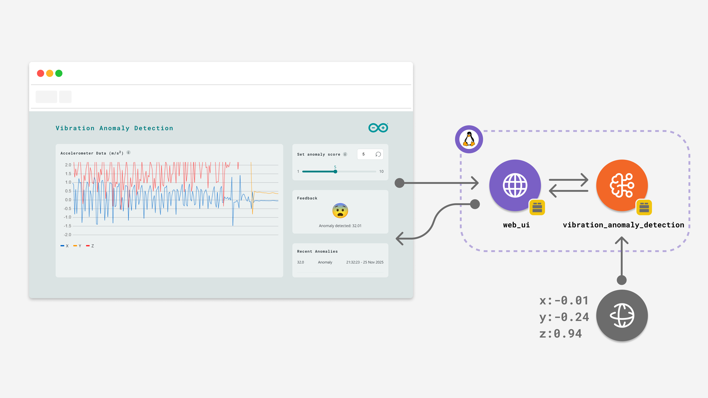

# QSense Node — Machine Vibration Monitor

> Part of **QSense Factory** · Snapdragon Multiverse Hackathon  
> Stage: **Detect** — the first node in the `Detect → Alert → Diagnose → Resolve` closed loop.



---

## What is QSense Factory?

QSense Factory is a **privacy-first, distributed edge-AI system** built for MSME manufacturers who can't afford to replace legacy machinery or send proprietary data to the cloud.

The system spans three devices that form a **closed loop** — not a one-way handoff:

| Device | Role | Stage |
|---|---|---|
| **Arduino UNO Q** (this repo) | Magnetically attaches to motors; continuously monitors vibration offline | Detect |
| **Snapdragon Copilot+ PC** | Receives anomaly alerts, logs events, pushes to mobile; also runs NPU-accelerated PPE detection | Alert |
| **Technician Mobile Device** | Receives alerts; locally runs a vision-language model for repair guidance from a photo | Diagnose → Resolve |

When the technician resolves the issue, the mobile device **signals back** through the PC to clear the dashboard and **reset the Arduino's baseline** — completing the cycle.

The result: a full factory AI assistant that catches problems early, explains how to fix them, and runs **entirely on-premises** — no internet required at any stage.

---

## This Repo — QSense Node

This repository contains the **Arduino UNO Q node** — the Detect stage. It retrofits existing motors with a magnetically-attached sensor that continuously monitors vibration for early signs of failure, entirely offline.

### What it does

- Reads raw accelerometer data (X, Y, Z axes) from a **Modulino Movement** sensor at 62.5 Hz
- Runs a **vibration anomaly detection** model locally on the board
- Streams live data to a real-time web dashboard over the local network
- Fires an alert (with anomaly score + timestamp) when vibration deviates from the learned baseline
- Accepts dynamic **threshold adjustments** from the dashboard without restarting
- Exposes a **reset endpoint** so the Copilot+ PC can reset the baseline once a repair is confirmed

### Architecture

```
┌─────────────────────────────────────────────────────┐
│                 Arduino UNO Q                       │
│                                                     │
│  sketch.ino  ──Bridge.notify──►  main.py            │
│  (62.5 Hz IMU read)             │                   │
│                                 ├─► VibrationAnomalyDetection Brick
│                                 ├─► WebUI (live plot + controls)
│                                 └─► anomaly_detected event ──► PC
└─────────────────────────────────────────────────────┘
```

---

## Hardware Requirements

| Component | Quantity |
|---|---|
| Arduino UNO Q (or Arduino VENTUNO Q) | 1 |
| Modulino Movement (LSM6DSOX IMU) | 1 |
| Qwiic Cable | 1 |
| USB-C to USB-A Cable | 1 |

Mount the sensor magnetically onto the motor casing — no invasive modification required.

---

## Software Requirements

- **Arduino App Lab** — to deploy and run the app on the UNO Q
- No cloud account or internet connection needed at runtime

---

## Project Structure

```
qsense-node/
├── app.yaml              # App manifest (name, bricks, icon)
├── sketch/
│   ├── sketch.ino        # Arduino firmware — IMU read loop, Bridge.notify
│   └── sketch.yaml       # Board & library config
├── python/
│   └── main.py           # Python backend — anomaly detection, WebUI, Bridge RPC
└── assets/
    ├── index.html        # Dashboard — QSense Factory v2 design system
    ├── style.css         # QSense design tokens (Coral/Amber/Slate/Sage pipeline colours)
    ├── app.js            # Canvas chart, slider, anomaly list, feedback logic
    ├── img/              # Icons and logos
    ├── fonts/            # Local font files
    └── libs/             # socket.io, arduino.js
```

---

## How to Run

1. **Connect hardware**  
   Plug the Modulino Movement into the Arduino UNO Q via the Qwiic connector.

2. **Deploy via Arduino App Lab**  
   Open the project in App Lab and flash + run it on the board.

3. **Open the dashboard**  
   Navigate to `http://<UNO-Q-IP-ADDRESS>:7000` from any browser on the same network.

4. **Monitor**  
   The **Accelerometer Data** chart shows live X/Y/Z waveforms. Mount the sensor on a motor or fan to see real vibration patterns.

5. **Tune sensitivity**  
   Use the **Anomaly Threshold** slider.  
   - Lower → more sensitive (small deviations trigger alerts)  
   - Higher → less sensitive (only strong deviations trigger alerts)  
   - The value is a raw anomaly score, not a 0–1 confidence.  
   - Use the numeric input for scores above the slider range (>20).

6. **Trigger a test anomaly**  
   Shake the sensor by hand. The **Status** panel will flag the event and log it in **Recent Anomalies** with a timestamp and score.

---

## How it Works

### Firmware — `sketch.ino`

Runs a timed loop at 16 ms intervals (62.5 Hz). Reads X, Y, Z acceleration from the LSM6DSOX IMU and sends values to the Python layer via `Bridge.notify`.

```cpp
void loop() {
  if (currentMillis - previousMillis >= interval) {
    has_movement = movement.update();
    if (has_movement == 1) {
      x_accel = movement.getX();
      y_accel = movement.getY();
      z_accel = movement.getZ();
      Bridge.notify("record_sensor_movement", x_accel, y_accel, z_accel);
    }
  }
}
```

### Backend — `main.py`

Receives IMU data via Bridge RPC, converts from g to m/s², feeds the detection brick, and pushes events to the WebUI.

```python
def record_sensor_movement(x: float, y: float, z: float):
    x_ms2, y_ms2, z_ms2 = x * 9.81, y * 9.81, z * 9.81
    ui.send_message('sample', {'x': x_ms2, 'y': y_ms2, 'z': z_ms2})
    vibration_detection.accumulate_samples((x_ms2, y_ms2, z_ms2))
```

Dynamic threshold updates from the slider arrive as a WebUI message and are applied immediately:

```python
def on_override_th(value: float):
    vibration_detection.anomaly_detection_threshold = value
```

### Dashboard — `index.html` + `app.js`

Built with the **QSense Factory design system (v2 — light/minimal)**:

- **Clash Display** for headlines and anomaly scores
- **Satoshi** for body text and labels
- Pipeline stage colours: Coral `#EA6F56` (Detect) · Amber `#F0B94D` (Alert) · Slate `#445067` (Diagnose) · Sage `#6FA980` (Resolve)
- HTML5 Canvas scrolling chart for live X/Y/Z waveforms
- Real-time anomaly list with score, label, and timestamp
- Full-round pill slider for threshold control

---

## The Closed Loop

```
Arduino UNO Q          Copilot+ PC            Mobile Device
─────────────          ───────────            ─────────────
Detect anomaly  ──►   Log + push alert  ──►  Receive alert
                                              Photograph component
                                              VLM generates repair steps
                       Clear dashboard  ◄──  Mark resolved
Reset baseline  ◄──   Signal reset
```

Every node is necessary. The three devices don't hand off once — they form an actual **closed cycle** from detection to resolution.

---

## License

SPDX-FileCopyrightText: Copyright (C) Arduino s.r.l. and/or its affiliated companies  
SPDX-License-Identifier: MPL-2.0
